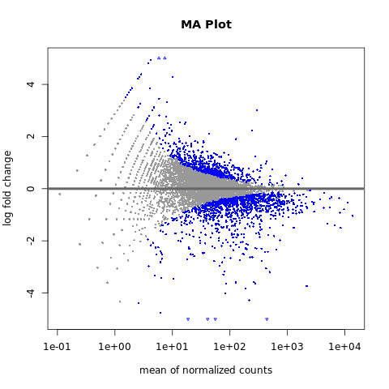
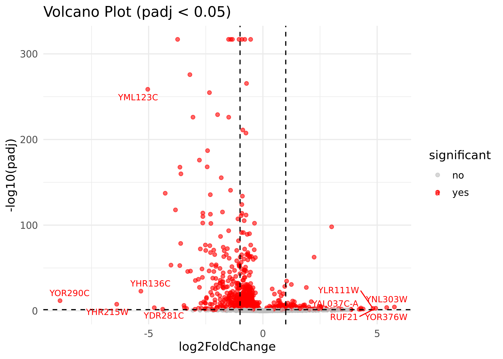
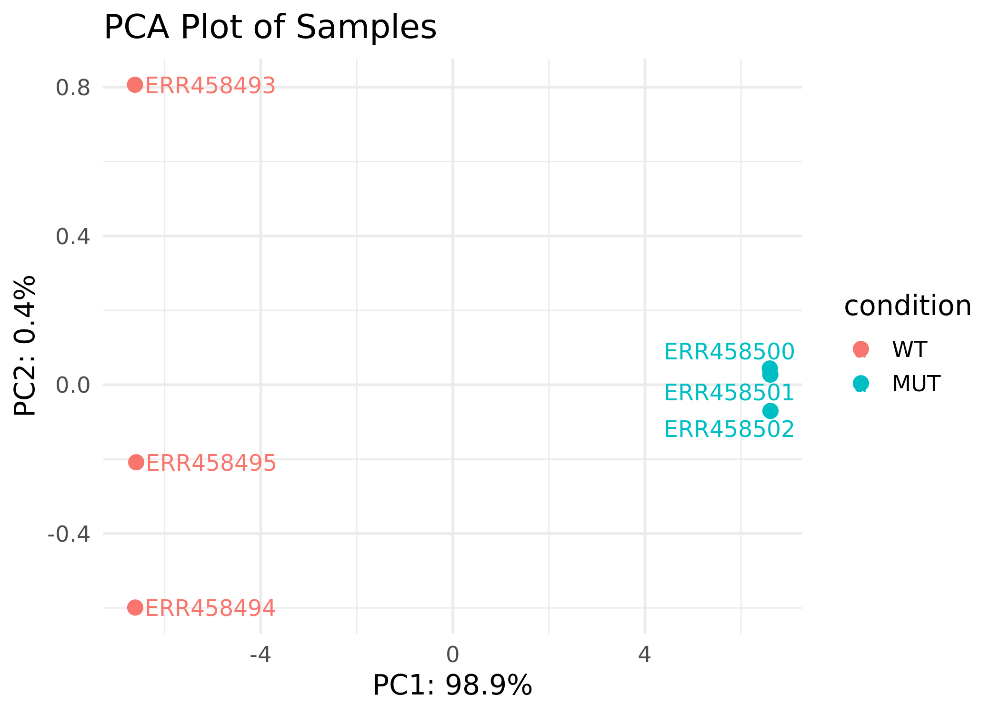
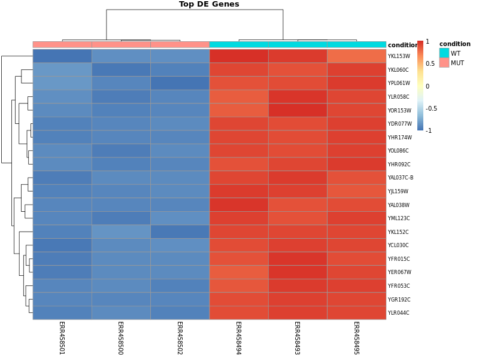

# Rnaseq_workflow_yeast
RNA-seq pipeline for yeast (WT vs SNF2 knockout(MUT)) with automated Snakemake workflow and Docker environment.
## Introduction
This repository contains a fully reproducible RNA-seq analysis pipeline for 6 RNA-seq samples of Saccharomyces cerevisiae to identify differentially expressed genes between two experimental groups: wild-type (WT) and SNF2 knockout (snf2 KO) mutant. SNF2 encodes the ATPase subunit of the SWI/SNF chromatin-remodeling complex, which regulates transcription by repositioning nucleosomes and making DNA accessible to transcription machinery. Deletion of SNF2 disrupts chromatin remodeling, leading to altered gene expression across the genome.
The workflow is automated using Snakemake inside a Docker container, and it covers all standard RNA-seq steps in NGS-based expression profiling:
1.	Download raw FASTQ files
2.	Preprocess reads (quality control)
3.	Align reads to the reference genome (using STAR)
4.	Count features (featureCounts)
5.	Perform differential expression analysis (DESeq2)
6.	Statistical analysis and visualization

## 1. Project Overview
The primary objective of this project is to identify genes whose expression is altered in the absence of SNF2, providing insights into chromatin-dependent transcriptional regulation. RNA-seq data from BioProject PRJEB5348 were used:
- WT samples: ERR458493, ERR458494, ERR458495
- SNF2 knockout (snf2 KO) samples: ERR458500, ERR458501, ERR458502  
Differential expression analysis produces gene counts, log2 fold changes, adjusted p-values, and multiple plots (MA plots, Volcano plots, PCA, heatmaps), providing a comprehensive view of transcriptional changes caused by SNF2 deletion.

## 2. Tools & Dependencies
Workflow engine: Snakemake  
Programming: Python 3, R

Docker-installed tools:

- FastQC – Raw read quality assessment
- MultiQC – Aggregates QC reports
- Cutadapt – Adapter trimming (optional)
- STAR – Genome alignment
- featureCounts (Subread) – Gene-level quantification
- Samtools – BAM processing
- R + Bioconductor packages: DESeq2, ggplot2, pheatmap, ggrepel
- Utilities: wget, curl, git


## Running the Pipeline with Docker

This project uses Docker to ensure a fully reproducible environment with all dependencies pre-installed.

### Build the Docker Image

```
docker build -t rnaseq_pipeline .

```
### Running the RNA-seq Pipeline with Docker

#### 1. Start the Docker Container

Open a bash shell inside the container:

```
docker run -it --rm rnaseq_pipeline
```
#### 2. Prepare Scripts

Convert all scripts to Unix line endings before running Snakemake to avoid errors:
```
dos2unix scripts/*.R
dos2unix Snakefile
```
> Note: `dos2unix` is used to ensure all scripts have Unix line endings.

#### 3. Execute the Snakemake Pipeline

Inside the container, run:

```
snakemake --cores 4 --printshellcmds &> snakemake.log
```


## 3. Data
### 3.1 Study / Project Accession

Raw FASTQ files for all samples were downloaded from the European Nucleotide Archive (ENA): https://www.ebi.ac.uk/ena/browser.

All samples belong to the ENA project [PRJEB5348](https://www.ebi.ac.uk/ena/browser/view/PRJEB5348).  
Organism: *Saccharomyces cerevisiae* (Tax ID: 4932)

### 3.2 Raw RNA-seq Data
Raw RNA-seq data were downloaded from ENA/SRA. The table below lists the run accessions (ERR IDs) used for analysis:

| **Sample ID** | **Run Accession** | **Link** |
|-----------|---------------|------|
| SAMEA2400697 | ERR458493 | [ENA](https://www.ebi.ac.uk/ena/browser/view/ERR458493) |
| SAMEA2400698 | ERR458494 | [ENA](https://www.ebi.ac.uk/ena/browser/view/ERR458494) |
| SAMEA2400699 | ERR458495 | [ENA](https://www.ebi.ac.uk/ena/browser/view/ERR458495) |
| SAMEA2400704 | ERR458500 | [ENA](https://www.ebi.ac.uk/ena/browser/view/ERR458500) |
| SAMEA2400705 | ERR458501 | [ENA](https://www.ebi.ac.uk/ena/browser/view/ERR458501) |
| SAMEA2400706 | ERR458502 | [ENA](https://www.ebi.ac.uk/ena/browser/view/ERR458502) |

### 3.3 Metadata
The sample metadata table [`samples.csv`](data/samples.csv) contains information about the samples, which maps each run accession to its experimental condition (WT or SNF2 knockout) and replicate number, along with SRA accessions and download links. This table is used to automate FASTQ downloading, read counting, and differential expression analysis in the pipeline.

### 3.4 File Structure
All samples are single-end reads. The raw data files are organized in data/raw_fastq/.
data/
├── raw_data/ # Raw FASTQ files
├── processed_data/ # BAM files and count tables
└── samples.csv # Metadata

scripts/ # Analysis scripts
results/ # Figures and tables
notebooks/ # Jupyter/R notebooks
README.md # Project overview

## 4. Workflow
1. **Quality Control:** FastQC
2. **Adapter Trimming:** Cutadapt  
3. **Read Alignment:** STAR  
4. **Gene level quantification:** featureCounts  
5. **Differential Expression Analysis:** DESeq2
   
### 4.1 Quality Control (FastQC & MultiQC)
Assessing the read quality is important before alignment. It detects low-quality reads, adapter contamination, GC bias, duplication and helps to determine whether trimming (Cutadapt) is necessary. MultiQC aggregates all FastQC reports into a single summary.
Generated reports included:
1. Per-base quality score distribution
2. Adapter/overrepresented sequences
3. GC content
4. Sequence duplication levels

### 4.2 Adapter Trimming (Cutadapt)  
Quality assessment using FastQC showed that the reads had high per-base quality scores and no detectable adapter contamination. Because both quality and adapter content passed the required thresholds, hence trimming was unnecessary for this dataset.

### 4.3 Read Alignment (STAR)

#### Reference Genome and Annotation

The reference genome and annotation for *Saccharomyces cerevisiae* (assembly **R64-1-1**) are downloaded automatically through the Snakemake workflow.

- **FASTA (Genome Sequence):**  
  `data/reference/Saccharomyces_cerevisiae.R64-1-1.dna.toplevel.fa`  
  Downloaded from: [Ensembl Fungi FTP](ftp://ftp.ensemblgenomes.org/pub/fungi/release-56/fasta/saccharomyces_cerevisiae/dna/Saccharomyces_cerevisiae.R64-1-1.dna.toplevel.fa.gz)

- **GTF (Gene Annotation):**  
  `data/reference/Saccharomyces_cerevisiae.R64-1-1.56.gtf`  
  Downloaded from: [Ensembl Fungi FTP](ftp://ftp.ensemblgenomes.org/pub/fungi/release-56/gtf/saccharomyces_cerevisiae/Saccharomyces_cerevisiae.R64-1-1.56.gtf.gz)

#### STAR Genome Index

The STAR genome index is built dynamically by the workflow in:  
data/reference/STAR_index/

- The `--sjdbOverhang` parameter is automatically calculated from the **first FASTQ read length** to optimize splice junction detection.  
- This ensures reproducible and accurate alignment for all samples.

**STAR (Spliced Transcripts Alignment to a Reference)** was used to align RNA-seq reads to the reference genome. STAR is splice-aware, allowing reads to be mapped accurately across exon-exon junctions, which is critical for eukaryotic RNA-seq. Correct alignment ensures accurate quantification of gene expression.  

Aligned reads are stored as **coordinate-sorted BAM files** in:  
data/star_aligned/{sample}.Aligned.sortedByCoord.out.bam  

These BAM files are then used for:  
- **Read counting** with `featureCounts`  
- **Visualization** in genome browsers

### 4.4 Gene-Level Quantification (featureCounts)

Aligned reads were quantified at the **gene level** using `featureCounts` with **single-end stranded reads** (`-s 1`), producing a matrix of read counts:  
data/featurecounts/featureCounts_gene_counts.txt

- Provides **counts per gene across all samples**, forming a gene expression matrix suitable for downstream differential expression analysis.  
- The `-s 1` parameter ensures that reads are counted **only if they map to the correct strand**, which is important for single-end RNA-seq data.  
- `featureCounts` efficiently converts read alignments into quantitative expression data, providing the foundation for **DESeq2** and other downstream analyses.  
- Accurate read counting is critical for **reliable identification of differentially expressed genes (DEGs)** and robust biological interpretation.


### 4.5 Differential Expression Analysis (DESeq2)

Differential expression analysis was performed using **DESeq2** via the R script:  
scripts/deseq2_yeast.R

This script automates statistical analysis and visualization of RNA-seq data. It performs the following steps:

#### 1. Loading Gene Counts and Metadata
- Reads `featureCounts` output:
  data/featurecounts/featureCounts_gene_counts.txt
- Reads sample metadata (`samples.csv`) specifying experimental groups (WT vs MUT).  
- Ensures **counts are correctly matched to sample conditions** for valid comparisons.

#### 2. Constructing a DESeqDataSet
- Uses `DESeqDataSetFromMatrix()` to combine counts and metadata into a single object.  
- Design formula: `~ condition` → compares expression between WT and MUT.  
- Models variability between groups while accounting for biological variation.

#### 3. Normalization
- Adjusts for differences in **sequencing depth** between libraries using size factors.  
- Ensures counts are comparable across samples, preventing bias from varying read numbers.

#### 4. Dispersion Estimation
- Accounts for natural variability in biological replicates.  
- Estimates **gene-specific dispersion parameters** to distinguish real biological changes from noise.

#### 5. Statistical Testing (Wald Test)
- Fits a **negative binomial model** for each gene.  
- Performs the **Wald test** to assess significance of expression differences.  
- Produces a **p-value for each gene** identifying statistically significant DEGs.

#### 6. Extracting Significant DEGs
- Computes **adjusted p-values (padj)** using the Benjamini-Hochberg procedure.  
- Controls the **false discovery rate (FDR)** across thousands of genes.  
- Genes with `padj < 0.05` are considered **significant DEGs**.  
- Output includes log2 fold changes, raw p-values, and adjusted p-values in:
  DESeq2_results.csv

#### 7. Visualization
- The script automatically generates **plots for result interpretation**, such as:  
  - MA plots
  - PCA plots
  - Sample Distance Heatmap
  - Volcano plots  
  - Heatmaps of significant DEGs  
- Provides an overview of expression changes and quality of differential expression analysis.

## 5. Visualization and Interpretation

Key plots generated from DESeq2 are saved in `data/deseq2_results/`.  

## Interpretation of Results

The RNA-seq analysis of **wild-type (WT)** and **snf2 KO mutant (MUT)** yeast samples provides insights into the transcriptional effects of SNF2 deletion. The key results are visualized using MA plots, Volcano plots, PCA, and heatmaps.  

### Summary
- These visualizations collectively confirm that **SNF2 deletion significantly alters the expression of specific genes**, particularly those involved in chromatin remodeling and transcription regulation.  
- MA and Volcano plots provide a global view of differential expression, while PCA and heatmaps reveal sample clustering and detailed gene-level patterns.  
- Together, these results set the stage for downstream analyses such as **GO enrichment** and **pathway analysis** to understand the functional consequences of SNF2 loss.

## Interpretation of Results

The RNA-seq analysis reveals how deletion of **SNF2** impacts gene expression in *Saccharomyces cerevisiae*. Key findings from the visualizations are summarized below:

### MA Plot

- The MA plot displays log2 fold changes versus mean normalized counts for all genes.  
- Genes near the M = 0 line (gray points) show no significant expression change, while genes moving away from M = 0 (blue points) are **significantly up- or downregulated** in the snf2Δ mutant.  
- Genes above M = 0 are upregulated in the mutant, while genes below are downregulated, highlighting the direct and indirect effects of SNF2 deletion.

### Volcano Plot

- The Volcano plot highlights **statistically significant DEGs** (adjusted p-value < 0.05) with high magnitude changes.  
- Points far from the origin in the x-axis (log2 fold change) and y-axis (-log10 padj) represent the most strongly affected genes.  
- Most significant candidates were identified and labelled for further study or pathway analysis. 

### PCA Plot


- Principal Component Analysis (PCA) shows how samples cluster based on overall gene expression patterns.  
- Clustering confirms separation between wild-type (WT) and mutant (snf2Δ) samples.  
- Separation between WT and MUT indicates that SNF2 deletion produces detectable transcriptomic changes.
- Outliers may indicate sample mislabeling or technical variation ensuring reliable downstream anlaysis, as observed with one mutant sample clustering near WT, which was then corrected immediately.

### Heatmaps
- **Top DE Genes Heatmap:**
  
  - Displays expression levels of the top 20 differentially expressed genes across all samples.  
  - Dark red indicates high expression; dark blue indicates low expression.  
  - Patterns reflect genes that are consistently up- or downregulated in the mutant relative to WT.
  - Sample clustering in heatmaps often mirrors the PCA results, reinforcing patterns of group separation. 
- **Sample Distance Heatmap:**  
  - Visualizes overall similarity between samples based on global gene expression.  
  - Confirms clustering patterns observed in PCA, highlighting biological consistency between replicates.  

### Overall Interpretation
- These visualizations collectively confirm that **SNF2 deletion significantly alters the expression of specific genes**, particularly those involved in chromatin remodeling and transcription regulation.  
- Some genes are **directly downregulated** because they are normally activated by SNF2, while others are **indirectly up- or downregulated** due to downstream regulatory effects.  
- MA and Volcano plots provide a global view of differential expression, while PCA and heatmaps reveal sample clustering and detailed gene-level patterns.  

## GO Enrichment and Pathway Analysis

To further understand the biological impact of SNF2 deletion, differentially expressed genes (DEGs) can be analyzed for **functional enrichment**:

- **Gene Ontology (GO) Enrichment:**  
  Identify which biological processes, molecular functions, and cellular components are overrepresented among DEGs.  
  Example: Chromatin remodeling, transcription regulation, stress response.

- **Pathway Analysis:**  
  Explore pathways (e.g., KEGG, Reactome) affected by SNF2 deletion to reveal broader regulatory networks.

- **Interpretation:**  
  Enrichment results will provide insights into **direct vs indirect targets of SNF2**, highlighting processes that are significantly impacted in the snf2Δ mutant.  

**Conclusion:**  
The RNA-seq analysis identifies genes differentially expressed between WT and MUT, with patterns consistent across replicates. These results provide insights into the molecular effects of the mutation on yeast gene expression.


